# Applied Machine Learning Algorithms

## Review

### Defining model vs. algorithm

An algorithm is a mathematical technique or equation(that is, a framework).

A model is an equation that is formed by using data to find the parameters in the equation of an algorithm.

example:

### Process overview

## Logistic Regression

**Regression** is a statistical process for estimating the relationships among variables, often to make a prediction about some outcome.

**Logistic regression** is a form of regression where the target variable is binary.

Example:

When and when not

#### Hyperparameters

The C hyperparameter is a regularization parameter in logistic regression that controls how closely the model fits to the training data.

Regularization is a technique used to reduce overfitting by discouraging overly complex models in some way.

Example:

## Support Vector Machines

A support vector machine is a classifier that finds an optimal hyperplane that maximizes the margin between two classes.

Example:

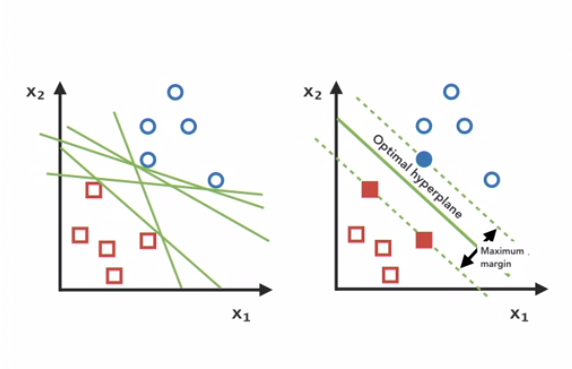

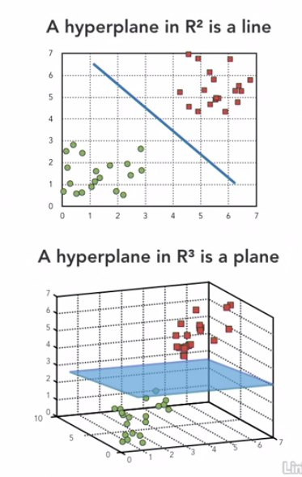

The kernel trick (or kernel method) transforms data that is not linearly separable in n-dimensional space to a higher dimension where it is linearly separable.

Example:

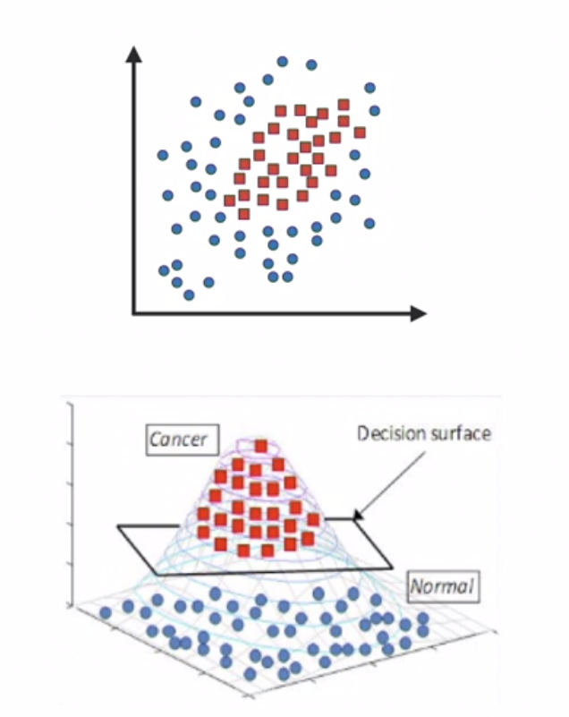

When and when not

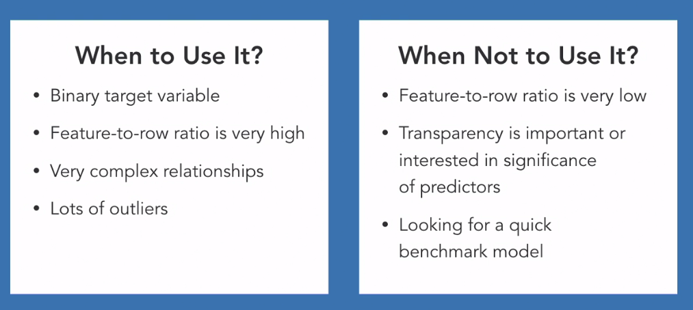

C

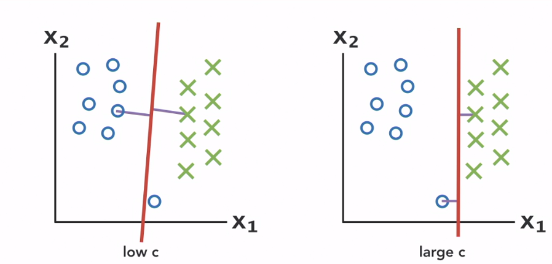

## Multi-layer Perceptron

A multilayer perceptron is a classic feed-forward artifical neural network, the core component of deep learning.

Alternativerly: A multilayer perceptron is a connected series of nodes (in the form of a directed acyclic graph), where each node represents a function or a model.
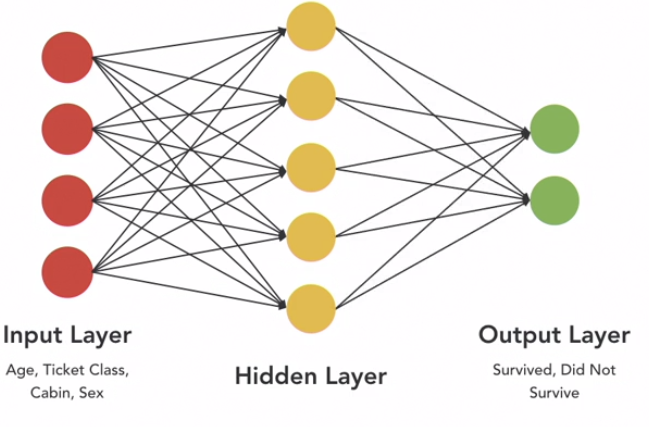

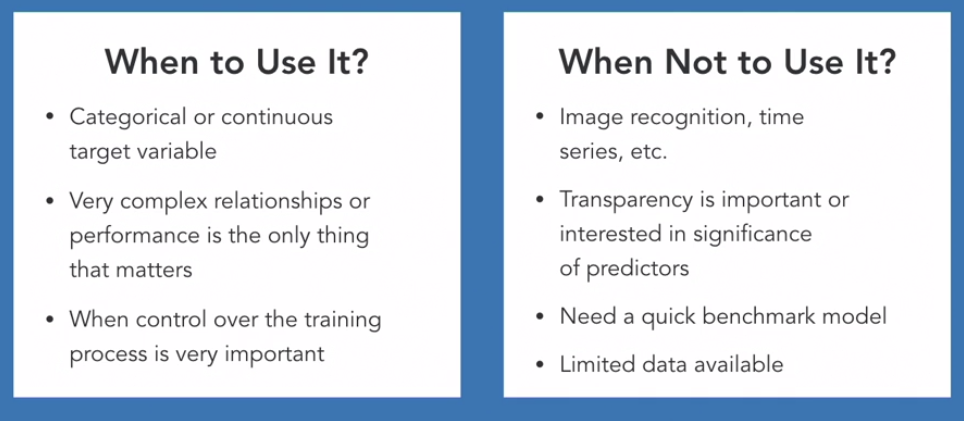

The hidden layer size hyperparameter determines how many hidden layers there will be and how many nodes in each layer.

The activation function hyperparameter dictates the type of nonlinearity that is introduced to the model.

- Sigmoid
- TanH
- ReLU

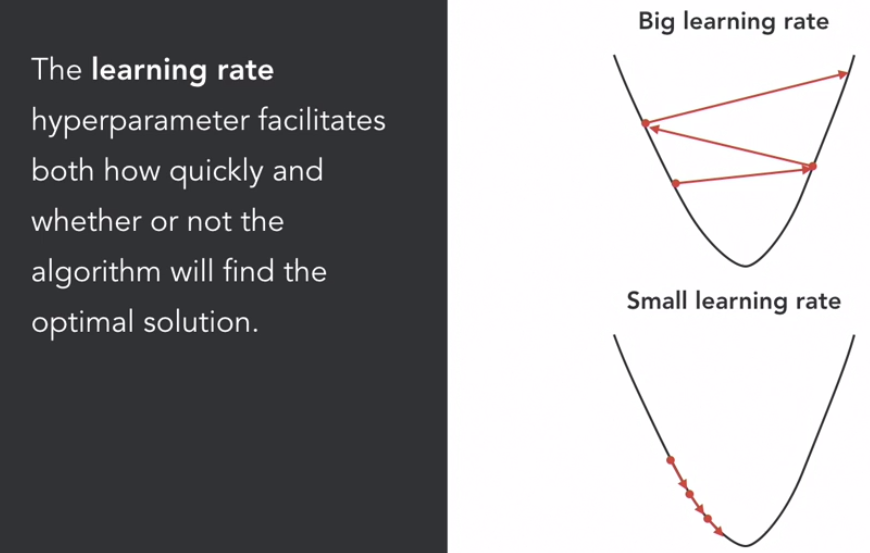

## Random Forest

A random forest merges a collection of independent decision trees to get a more accurate and stable prediction.

Ensemble methods combine several machine learning models in order to decrease both bias and variance.

Majority Voting

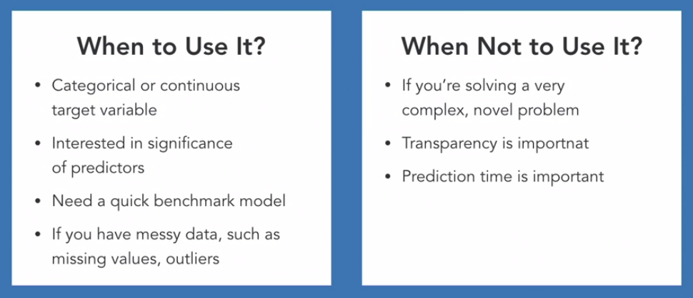

The n_estimators hyperparameter controls how many individual decision trees will be built.

- width of tree

The max_depth hyperparameter controls how deep each individual decision tree can go.

- depth of tree

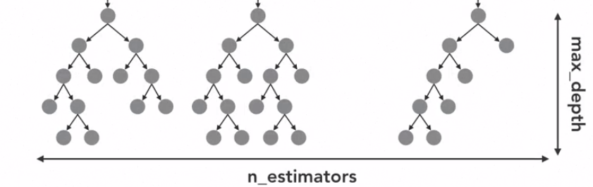

## Boosting

Boosting is an ensemble method that aggregates a number of weak models to create one strong model.

A weak model is one that is only slightly better than random guessing. A strong model is one that is strongly correlated with the true classification.

Boosting effectively learns from its mistakes with each iteration.

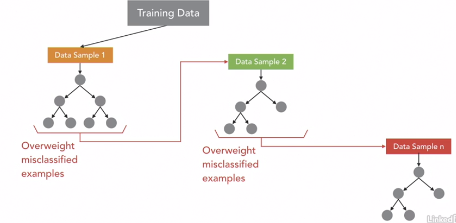

Training is sequential. Prediction is parallel.

Weighted Voting

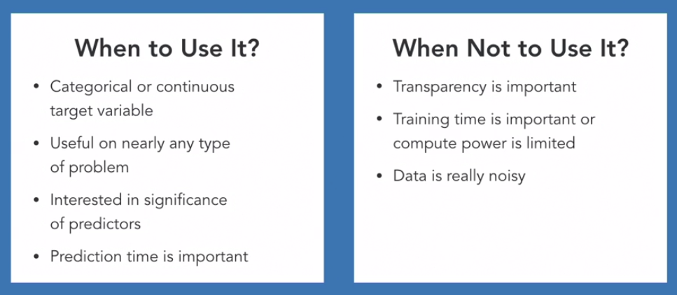

learning rate

max_depth lower than Random Forest

## Summary

