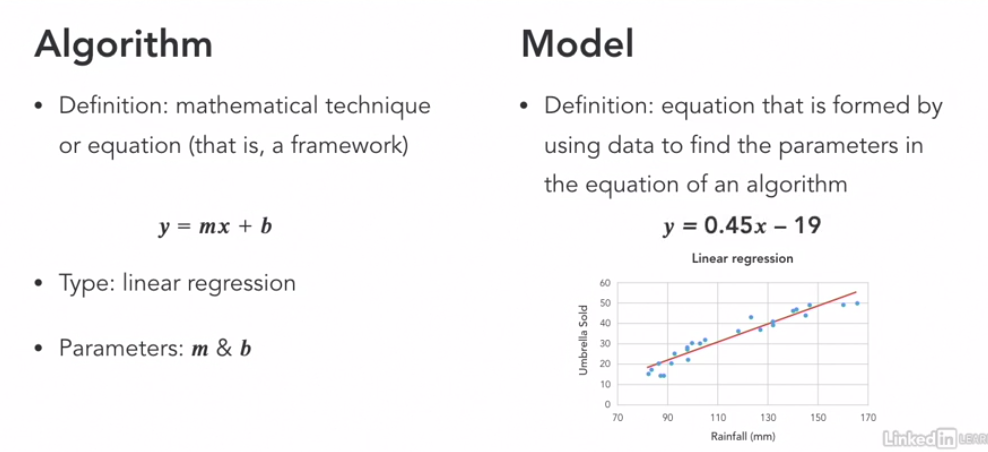
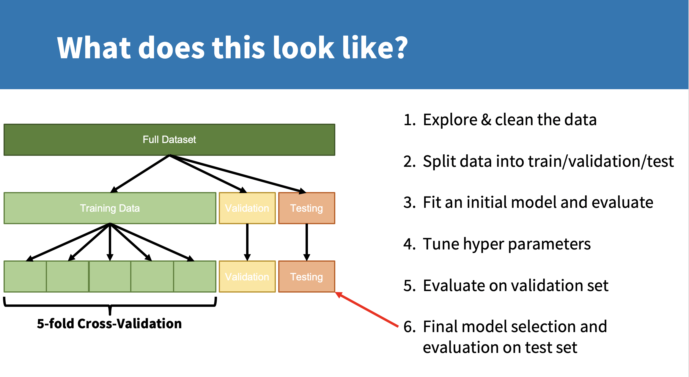
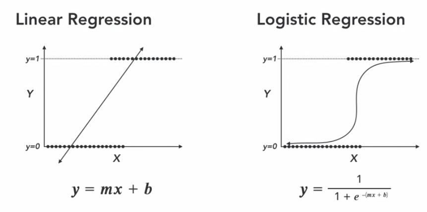
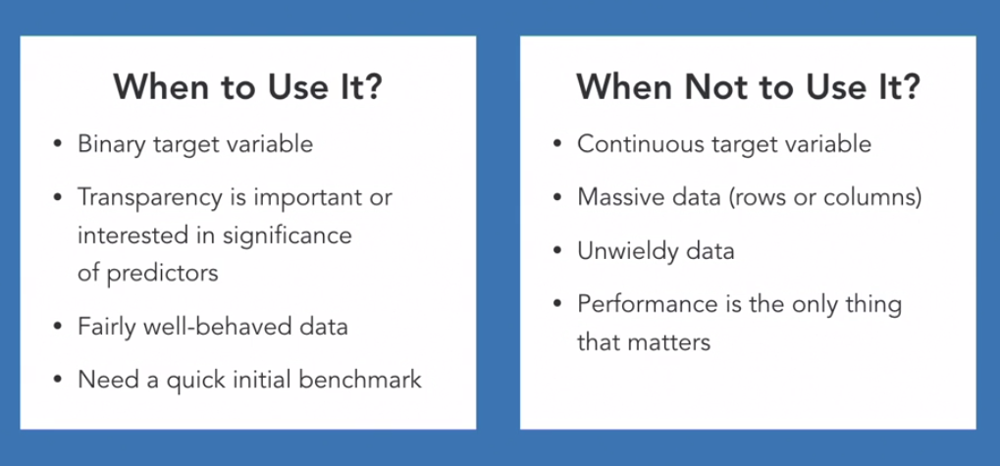
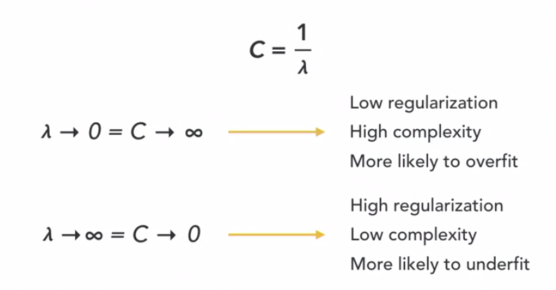
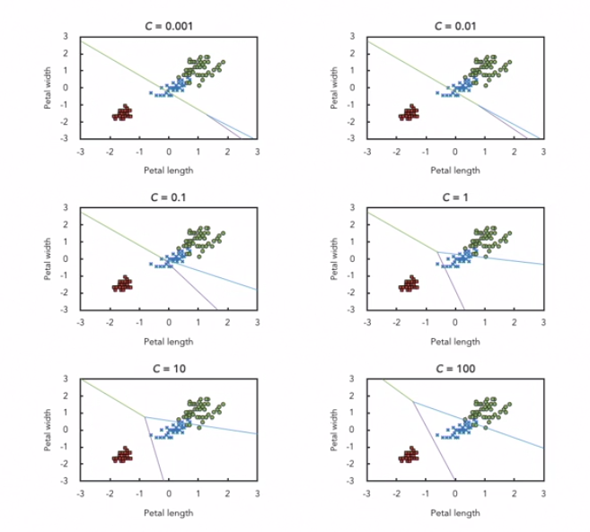

# Applied Machine Learning Algorithms

## Review

### Defining model vs. algorithm

An algorithm is a mathematical technique or equation(that is, a framework).

A model is an equation that is formed by using data to find the parameters in the equation of an algorithm.

example:

### Process overview

## Logistic Regression

**Regression** is a statistical process for estimating the relationships among variables, often to make a prediction about some outcome.

**Logistic regression** is a form of regression where the target variable is binary.

Example:

When and when not

#### Hyperparameters

The C hyperparameter is a regularization parameter in logistic regression that controls how closely the model fits to the training data.

Regularization is a technique used to reduce overfitting by discouraging overly complex models in some way.

Example:

## Support Vector Machines

## Multi-layer Perceptron

## Random Forest

## Boosting

## Summary

