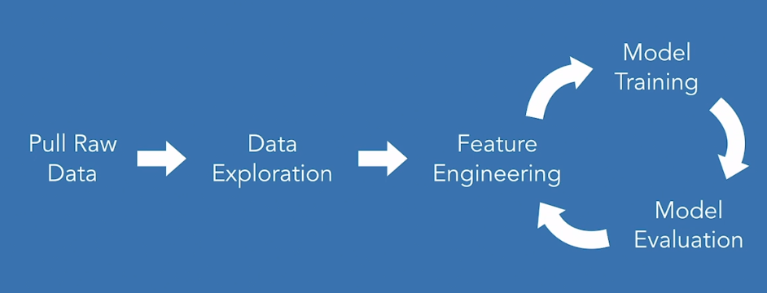

# Applied Machine Learning Feature Engineering

## Review

What is machine learning?

What does machine learning look like in real life?

What does an end-to-end machine learning pipeline look like?

## Feature Engineering

Feature engineering is the process of transforming raw data into features that better represent the underlying signal to be fed to a machine learning model, resulting in improved model accuracy on unseen data.

GIGO: Garbage In, Garbage Out

The quality of information coming out cannot be better than the quality of information that went in.

Better Features

- More Flexibility
- Simpler Models
- Better Results

#### Tools in the Feature Engineering Toolbox

- Common sense and domain expertise
- Dropping irrelevant features (feature selection)
- Cleaning existing features
  - Impute missing values
  - Remove outliers
  - Scale the data
  - Transform skewed data
- Splitting or grouping features
  - Combine two related features to make one
  - Split one feature into two
- Binning or creating indicator variables
  - Convert a continous variable into simpler categorical feature
- Learning new features
  - learning word or document embeddings from raw text

## Explore the Data

## Creating and Cleaning Features

## Prepare Features for Modeling

## Compare All Features

## Conslusion

